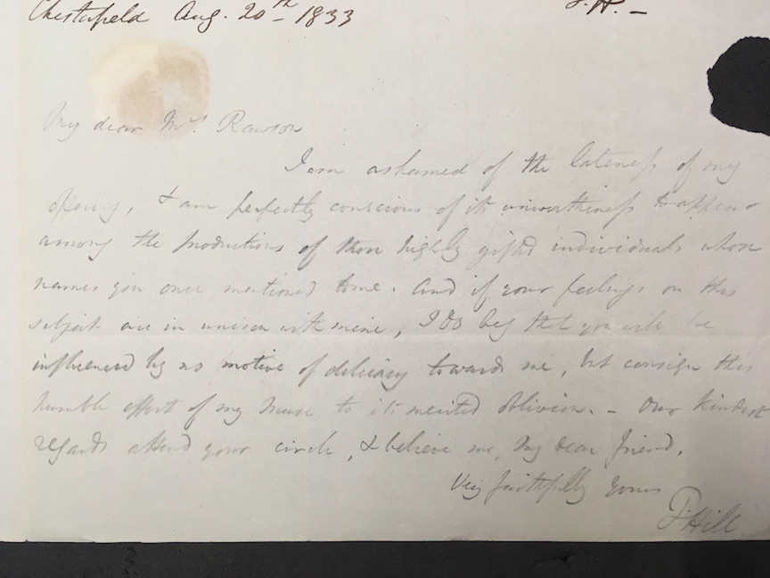
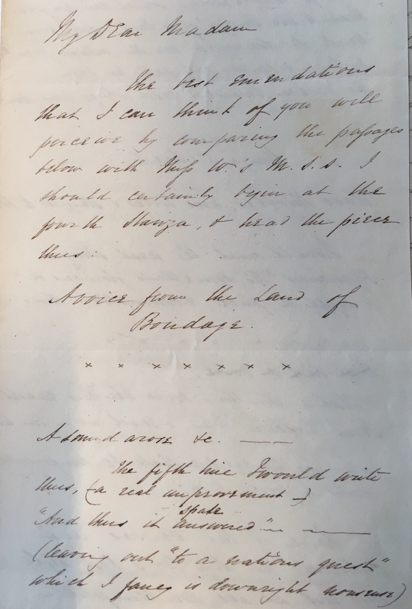

## Mary Anne Rawson's *The Bow in the Cloud* and the Networks of Anti-Slavery Literature

Christopher Ohge

(*Institute of English Studies, School of Advanced Study, University of London*)

<!-- TOC depthFrom:1 depthTo:6 withLinks:1 updateOnSave:1 orderedList:0 -->
---
- [A Definitive Object, a Solidity of Purpose](#a-definitive-object-a-solidity-of-purpose)
- [Textual transactions](#textual-transactions)
- [Publication History](#publication-history)
- [Reception](#reception)
- [New Discoveries](#new-discoveries)
- [Reception](#reception)
---

### A Definitive Object, a Solidity of Purpose

>_"The plan appears to me very promising, and I hope, and that its success will further the amiable design of its formation––as a publication ... which though so attractive to the Eye, and in some of their contributions, so touching to the heart, have always seemed to me as wanting a definitive object, a solidity of purpose..."_

_(Mary Sterndale to Mary Anne Rawson, 28 February 1833)_

*The Bow in the Cloud* was truly an anti-slavery collection with international aspirations. Its ambition is partly reflected by the fact that it was an 8-year project, one that sought to influence the abolitionist movement between the time when slavery had been abolished in the UK, and was still legal in the colonies, to the time when it was abolished in the colonies but still very much alive in the Middle East and various parts of the Americas. In 1826, Mary Anne Read was a young activist encouraged by the example of her parents, who were well-known philanthropists, to use literature to influence public opinion; but the project stalled. By 1834, Mary Anne, now married to George Rawson, having re-ignited the project, put *The Bow in the Cloud* into publication.

Many of the figures in this collection require more exploration: just as a simple example, only about half of the figures here are on Oxford DNB or Wikipedia, but some do not even mention their abolitionism, or their literary contributions to this anthology (examples: Mr and Mrs Gilbert). Yet the material contents of the book itself lack a thorough textual history. The history is crucial in this example not only because it is an early example of the politically-themed literary anthology, but also because the surviving manuscript collection is vast and very revealing. Each submission to the anthology came with a covering letters (and a few submissions have multiple letters either from 1826 and 1833 or in response to revisions to their submissions).

What also requires exploration is a meditation on the nature of the enterprise itself: an anthology, edited by someone with specific aims. How were these pieces solicited (and who declined, which pieces were rejected, and which were eventually published)? How were they received, edited, organized, and designed? The surviving evidence now being brought out will gives the best sense yet.

All told, the surviving manuscripts constitute a much fuller history of opinions of prominent anti-slavery advocates between roughly 1826 and 1834. [There is also a thread of the nonconformist congregationalists] The unpublished letters alone feature several rhetorical nuances that do not get reflected in the published poems and prose.

This edition of *The Bow in the Cloud* seeks to understand the people---some of whom have been forgotten---who used literature to influence public opinion. Many of these crucial figures are veiled in the public imagination, yet it is scholarship like this that can enhance the material contributions of nineteenth-century British abolitionists. It is not the purpose of this edition to engage in a debate about the validity of their arguments and approaches. Rather, the aim is to lend their lives and works some more context, to make their arguments more accessible to students and researchers, and to facilitate a more nuanced discussion of anti-slavery literature.

And this was a collection looking before and after, for the British government abolished slavery in 1807 in the United Kingdom, and in 1833 abolished it in the colonies. What was left to do? To commemorate the abolishment in the United Kingdom and to continue to advocate for abolition in the world. Great care went into explaining this, as is evident by the surviving manuscript of the preface, which went through several revisions. The first version was included in a letter to Rawson by Richard Cecil?.

Returning briefly to the letter from Mary Sterndale that I quoted at the beginning: It turns out that most of Sterndale's literary submissions and suggestions in her letters were not published. Only one poem, "The Slave Ship," was included. Yet Sterndale's characterization of the aims of the Bow in the Cloud demonstrates the importance of recovering the textual history of this astonishing collection of materials.

---

### Textual transactions

Some of the poems submitted to Rawson were unchanged. Yet some of the submissions show a significant level of editorial engagement and judgment. For example, Rawson received four? submissions from Bernard Barton, two of which began and ended the volume, and two more appeared elsewhere in the volume. This suggests an attention to selection.

Another textual transaction came with Thomas Hill's submission of "Grave of Wilberforce," a poem that went through several apologies as well as versions. He submitted three versions to Rawson. The final one includes a corrected stanza for “Grave of Wilberforce”, (“Conspicuous…”), with an explanatory footnote, as well as some additional suggestions for changes that were not adopted. The first fair copy submission is rather interesting, because it includes both minor revisions, as well as a note penciled in at the end of the poem:

Here is the note zoomed in:

>_My Dear Mrs Rawson
I am ashamed of the lateness of my
offering, & am perfectly conscious of its ..._

Yet he submitted another fair copy, which included a revision to the stanza beginning "For lo!"

Another clue left in the manuscripts comes from J. W. H. Pritchard's 26 December 1833 letter to Rawson. Pritchard was a contributor to the volume, but in that letter he also played the editor, suggesting changes to Miss Williams's poem (to which himself provided the title "Voice from the Land of Bondage").

   

Pritchard's next letter from 11 April 1834 is really crucial (see leaf 64 MS414-Box 2). It proves not only that he helped her edit the book, but also that he offered suggestions to Rawson's preface, which were adopted.

>*The sentence might admit of a change of this kind "It would indeed have been delightful if* every *hand which has taken a prominent part [or been actively employed] in pulling down the prison house, &amp; in striking off the fetters of the bondsmen, could have put &c"*

Here it was published:

Instances of Rawson's significant influence on the original manuscript submissions prove her active engagement. One of the more striking examples is the printing of an extract from a letter from Thomas Buxton, "Compensation for the Slave" (276–77). Buxton's submission came somewhat haphazardly in his 6 October 1833 letter to Rawson. At the end of his letter, he admits "you are of course at liberty" to include and emend his contribution. In her fair copy of his extract, Rawson proceeded to rewrite sections of it, seemingly as she went through it. [Show image of two sentences side-by-side?]

Yet she was not entirely satisfied with it. On the last page of her fair copy of Thomas Pringle's poem "The Wild Forester," she copied the first half of Buxton's letter extract in pencil and added further revisions which were adopted in the published version. About half of the published version turns out to be written by Rawson.

At the bottom of the page is the end of the Pringle poem fair copy. One of the more interesting changes is...

### Publication History
While in many ways *The Bow in the Cloud* was a publication of Northern writers and activists, it was published by Jackson and Walford (St. Paul's Churchyard).

The book was sold for 12 shillings, about 50 GBP in today's money. Put another way, it was about two days pay for a skilled tradesman, or about the cost of a week's supply of butchered meat and tea. In other words, this was a middle-class product, on the high end of affordability.

The volume is indeed handsome: the foolscap octavo pages were gilt, tightly bound in turkey morocco with a gilded engraving of the bow. The advertisement called attention to its quality.

### New Discoveries

Now that it has been established that Rawson exerted significant control of editing the book, it stands to inquire what she decided upon.

Obviously she did not include most of the letter material. The virtue of the accompanying digital edition is that those letters have now been edited and presented as appendices to each submission.

- Many of the poems exist in multiple versions.

- Others include significant revisions.

- Paratextual material: covering letters, photographs of some contributors.

- Rawson chose not to publish every piece she received.

#### "The Creole Maiden's Song"

#### James Montgomery's *Leonard Dober*

One of the most prominent voices in this collection is James Montgomery. He was a good friend of Rawson's, and was well connected to the literary world, being known as Scottish poet.

#### Ann Taylor and Mr. (Reverend) Gilbert

Possibly due to the fact that Rawson decided not to include full names of women contributors, it is easy to overlook three initials or names such as "Mrs. Gilbert"---which is a shame because one of the more lasting contributors to this volume is now best known as Ann Taylor, the poet known for children's verse written with her sister Jane Taylor. Rawson included both Mr. and Mrs. Gilbert in the collection. Joseph Gilbert's elegant and imposing essay "The Bible and Slavery" ... But more pieces (even though shorter) from Mrs. Gilbert are published. Her three poems...

Ann Gilbert's poem "The Mother" also includes a surprise in the archive: her submission came with a beautiful small watercolour illustration that Rawson did not use.

Three slaves are on a beach all in different poses. One bows on his knees, one on his feet with arms ambiguously extended, and a child who almost seems crouched in pain, covering his face.

The pathos of her poems stand in contrast to what is known for, children's verse. And yet children are part of the pathos here.

#### The Persecuted Missionary

- Jamaica as a locus of attention for abolitionists.

- William Knibb was a Baptist minister who advocated for "free villages". At the end of his contribution

- Included in the manuscripts are three letters from one Thomas Burchell, one of Knibb's colleagues who was a well-known missionary in Jamaica.

[Include images of Burchell and enclosure in BiC]

#### "He Being Dead Yet Speaketh"

- 3 versions of the poem. One version was significantly revised in pencil by MAR?

(see leaf 110b and c)

This is simple example on the first page of a pencil revision suggested by Rawson that was adopted in the publication. Later in the poem, though, the suggestions are far more numerous.

Rawson's editorial judgement is on full display here.

Yet there is more: Rawson chose not to publish every piece she received.

#### On "The Last Hour" ... "what had humanity now?"

Two poems by Sarah J. Williams were not included––they possibly written as a diptych, titled as they were "The Planter’s Last Hour" and "The Slave's Last Hour".

*The Planter's Last Hour*

> I saw a chamber in the abode of provided
  With all of rest that could be bought be gold;
  There was a bed of down, high canopied,
  And curtained round with damask's crimson fold.
  The windows were deep veiled and yet a ray––
  A single ray of the sweet ~~sunrise~~ ^sunlight^ shone
  Thro' dim room, and on that couch did play,
  And on the face of him who laid thereon,
   
  But he was dying––O there was a look
  On his white lips which moved convulsively,
  And all his features quivered and he shook
  As if a vision met his glazing eye.
  The hireling nurse was there, and serving men
  Waited his bidding; yet he was alone,
  Lone, for their hearts were not with him, &amp; when
  He spoke how deep and hollow was the updateOnSave
   
  That would so soon be silent ~~[em-dash]~~^!^ yet tho' then
  The gurgling sound of death was in his throat,
  He lifted his faint voice yet once again;
  It needed not a bended ear to Notes
  His accents midst that silence most profound,
  For each and every word the hush that broke
  Was horribly distinct, as if its sound
  Would fain be heard for ever, thus he spoke,...
   

*The Slave's Last Hour*

> I saw a spot in India's burning clime
 Thereon the shadow of a tree did fall
 With grateful shelter. It was evening time
 The hour of rest was coming fast, with all
 The stillness and "the beauty of repose"
 Which Nature grants unto the meanest thing
 That seeketh slumber at the long day's close.
 A weary slave his feeble form did fling
  
 Down on that green, cool sod, to wait for death.
 There was a calm upon his brow as tho'
 His spirit then had done with all beneath,
 Had suffered ~~his~~ ^its^ ^last^ pang of mortal woe.
 As yet the deep-toned gong, or crackling scourge*
 Had told not that the day of work was done,
 And sounded but the drooping slaves to urge
 To further toil, far from that dying one.
  
 \* The slaves on the Plantations are summoned to their work by the sounding of the gong or the cracking of the whip when used to announce the time of meals or of [returning?].  

The poem of hers that was included, "A Voice from the Land of Bondage", was also subject to a heavy hand: the first three stanzas were left out. Why was it expurgated? Possibly because of the explicit undertones of fatalism, and the presence of anger and revenge in the slave. The poem's opening is striking: "The die was cast." This parallels the language of the third line, "To fix the date"––suggesting a tension of what is to be determined with such injustice. Yet the third stanza must have come off as slightly too raw and pessimistic for the collection.

> ... The abject formation
Crouching before the pow'r it long'd to brave
The hollow smile, the welcome *seeming* warm
The mean, base artifice that mark'd the slave,
The unfaithful service, the unwilling toil
Extorted only by the scourge of power,
*Deeds* of revenge which make the heart recoil,
*Thoughts* of revenge in the dark brow that low'r,
All these things still that spirit look'd upon
And askèd, what humanity now?

*What humanity now?*: this question still rings true.

The next stanza was published; it more innocently begins with "A sound arose,––the voice of ancient wrong..." Which loses some of its force when the build-up in the previous three stanzas is extracted.

#### Toussaint Louverture

Perhaps the most important of the rejected pieces comes from Dinah Ball, whose poem glorifying Toussaint L'Ouverture must have been too controversial for a volume largely framed around Christian piety, not the violent revolution that is clearly celebrated in the opening stanzas.

>_Toussaint Louverture._
 _Cast a reflective glance athwart the flood
To that bold Isle where prowess and renown
Have urged their course through deluges of blood,
And snapped the Tyrant's yoke, and scorned his frown._
 _When Europe's unrelenting hand had swayed,
With scorpion rod, Domingo's land of slaves,
And Negro-vengeance had her deeds repaid
By massacres that died the circling waves,_
 _Benignant Heaven, in mercy to the oppressed,
Nurtured a Hero of the [jitty?] race,
This mighty soul with ample views possessed,
And stamped with moral dignity his face._

The poem encompasses seven manuscript pages, and it is truly a great pity that the poem was left out. For the first time, this edition is publishing this entire poem.

#### *A Reign of Terror*

Another poem that was not included was by James Everett which he titled "A Reign of Terror." In his 14 June 1826 covering letter, he justified the "simple form of expression" in his long poem: "I could view Slavery in no other light than that of one continued system of oppression and terror," and that his aim was "more of *strength* than of *ease*". The tone of the first two stanzas suggests as much, and more:

> Away, away, for Terror here
Usurps an universal reign;
Away, like righteous Lot, in fear,
Nor tarry those in all the plain;
Away, for through the Western Isle's,
Which sprang from ocean's bed in smiles
The demon stalks, and claims the whole,
Like him who once to Edon stole
And spread the blight of death:
His music is the victim's cry,
The shrivelling glance is in his eye,
Infection in his breath.
 
Talk not of joy where slavery reigns,
Of brightening hopes midst "hope defer'd,"
The negro's joys are hung in chains,
The negro's hopes are all interr'd:
He sees the writing on the wall
In laws, enacted to enthral,
And seems, in every driver's hand
To see upon the desert sand
The lion's fatal paw,
And in the voice of men of blood,
To hear the voice that shakes the wood,
And holds the soul in awe.    

After his stark criticisms of the law (ex), his penultimate stanza eerily predicts, "And judgment, though it linger long, | Will burst in wrath for Afric's wrong, | And now begins to move." The final stanza:

> Away,---for men of blood have piled
The fabric of their guilt so high
That dark, o'er Isles, which e'er had smiled,
It spreads its shadow to the eye:
Away,---for Vengeance springs to birth,
And with the whirlwind sweeps the earth,
And bears, like autumn leaves away
The men of guilt, whose iron sway,
Hold innocence in chains;
Away,---for down the fabric falls
The voice of blood for justice calls,
And God in Vengeance reigns.

### From the Emerald Isle

There is a poem entitled "The Triumph of Freedom" on pages 316–17. It is not signed by any author, but rather "From the Emerald Isle." Both versions are significantly revised, and written in the same hand that produced all the fair copies presumably furnishing the printer's copy. It is actually another poem by Elizabeth Walker, but it appeared to be significantly revised by Rawson in her hand.

### Thomas Pringle

One of the contributors was Thomas Pringle, a Scottish poet who wrote the first poetic descriptions of South Africa. Pringle was well-connected in the literary world; it is possible that Pringle encouraged Rawson to solicit work from John Clare, since Pringle had corresponded with Clare in the 1820s. Pringle corresponded with Rawson frequently in late 1833 as he sent her poems by him and by his friend Richard Hill. Pringle had been involved in a literary sensation by shepherding the publication of Mary Prince's slave narrative *The History of Mary Prince: A West Indian Slave*. As acting secretary to the Anti-Slavery Society, he had encouraged Prince to write her narrative and employed the Canadian-English author Susanna Moodie to transcribe the story. The controversy came after a letter in *Blackwood's* accused the Prince of inaccuracy and a libel case ensued (unsuccessfully).

But it is Pringle's letters that show an eccentric and energetic personality which is reflected in his poems about South Africa. he claims he is "thin-skinned" [ck].

His long poem, "The Desolate Valley," begins with a prose headnote that is actually a revision of a printed source.

### With regrets

Rawson's collection, as published, was a veritable who's who of the abolitionist movement at this time, featuring religious leaders, clerics, and writers of repute. Among those who declined, however, are prominent names such as Wordsworth, Southey, John Clare, Macaulay, Thomas Clarkson.

Wordsworth's letter declining to contribute might be one of the more fascinating aspects of the textual history of this book. He indicated that slavery is "on principle monstrous, but it is not the worst thing in human nature," suggesting that the purpose of poetry was to stand above immediate political concerns.

> Poetry, if good for anything, must appeal forcibly to the Imagination and the feelings, but what at this period we want above every thing, is patient examination and sober judgement.

He also expressed concern for the blowback that would accompany a "hasty" (as he called it) abolition.

> [T]here are three parties––the Slave––the Slave owner––and the imperial Parliament, or rather the people of the British Islands, acting through that Organ. Surely the course at present pursued is hasty, intemperate, and likely to lead to gross injustice.

Wordsworth's letter was included in the Oxford edition of his letters, but this project on the textual history of this anthology shows more clearly the context of Wordsworth's decision not to participate in this literary event.

Southey's (which has not yet been published) struck a tone of pragmatism, or weariness? Similar to Wordsworth, Southey thought the politics of slavery too polarized.

Another unpublished letter that declined, which has never been mentioned before, is from Thomas Clarkson, one of the principal leaders of the abolitionist movement.

Clarkson blames his cataracts, as well as a habit of mind that would cause too much delay in producing some writing, for not being able to contribute.

Another famous name to be requested was Thomas Macaulay. His letter to George Rawson (Mary Anne's husband), which was recently published in Thomas Pinney's collected edition of Macaulay's letters [Cambridge University Press, 2:92]), Macaulay claims he is simply "overwhelmed" by his affairs. He also references a friendly argument between him and Mary Anne...

What is probably the most tantalizing letter comes from John Clare. From his cottage in Helpston, he wrote a lengthy response to Read's initial call from 1826. This letter has never been published in full (it was not included in Mark Storey's Oxford edition of Clare's letters, and the only brief mentions of it I have seen are in Jonathan Bate's *John Clare* [Picador, 2003] p. 339, and Sarah Houghton-Walker's *John Clare's Religion* [Ashgate, 2013], p. 211). Neither of these instances, however, have explained the letter in the context of its purpose---Clare's hedging on contributing a poem to the collection). For it contains some interesting opinions about slavery that are hard to find elsewhere in Clare oeuvre.

Another unpublished letter declining to contribute was from Byron's friend Thomas Moore.   

### Reception

The publisher, Jackson and Walford (18 St Paul's Church-yard) was also responsible for the *Eclectic Review*, The *Congregational Year Books*, and other ecclesiastical books. One of the contributors to *The Bow in the Cloud*, Josiah Conder, had since 1813 been the owner and editor of the *Eclectic Review*, which also featured a substantial and laudatory review of *BIC* in its July 1834 issue. This was a significant, since *Eclectic Review* was one of the most prestigious literary periodicals of its time, one that not only published prominent romantics but also American authors such as Washington Irving. The periodical also had a wide American readership (it was reprinted Foster, Bisbee, and Co. in New York).

The US was still far behind: still, in 1840, anti-slavery was so counter to government that the us house barred receiving or even considering anti-slavery petitions (Freehling, *Reintegration*). That gag order lasted until 1844.

Goya's Black Paintings of the early 1820s showed the devouring cruelty of nature. Civilization turned into itself: how can we live life while accepting inhumane practices among us?

---

Notes (from meeting with SE and WG)

- Single-author editing. Didn’t need thematics.

- Anthology tradition: C19 sets and series. Study of reading experiences and how anthologies influence.

- John Spears—collection of Victorian reprints

- American editions / how many editions and impressions / afterlife of it / distribution / Disreali / was it cheap?

- Modeling / methodological point of view

- Reciter / reader / public

- Don’t put edition first. This impact — then move out again.

- Primary point: Power of anthologizing in C19, using editing as a broader tool. Providing a set of intellectual tools. Reader’s Digest books: pure classics. Same for anthologies. How did it work in terms of the self-educators. Move in and out between — larger promises confident enough…

- Talk to Dan: Kind of money — term of award —

- AHRC, then Leverhulme, then AHRC early-career.

- Leverhulme twist?    
