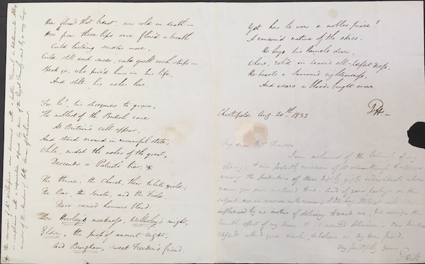
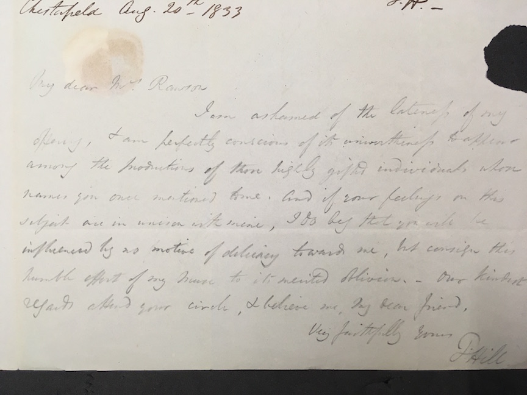
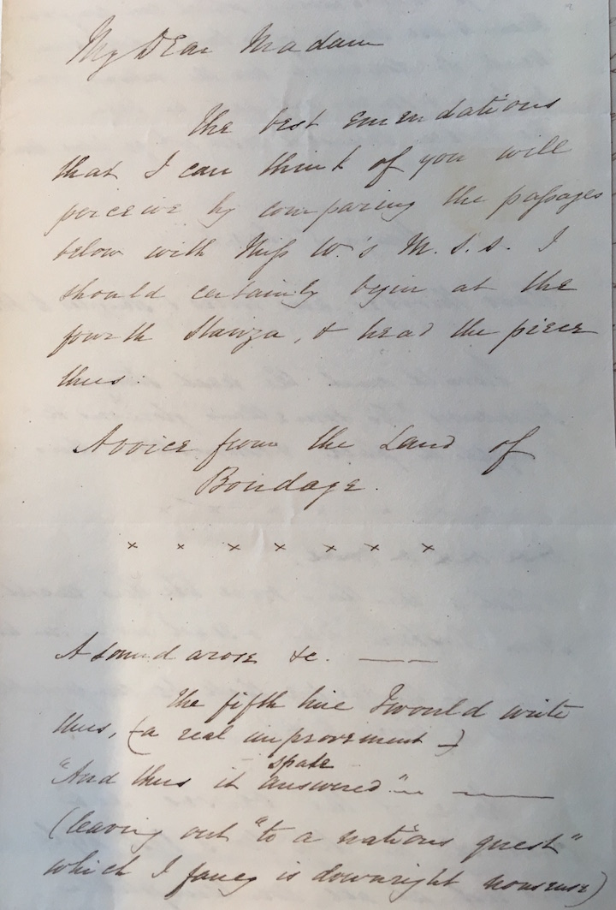
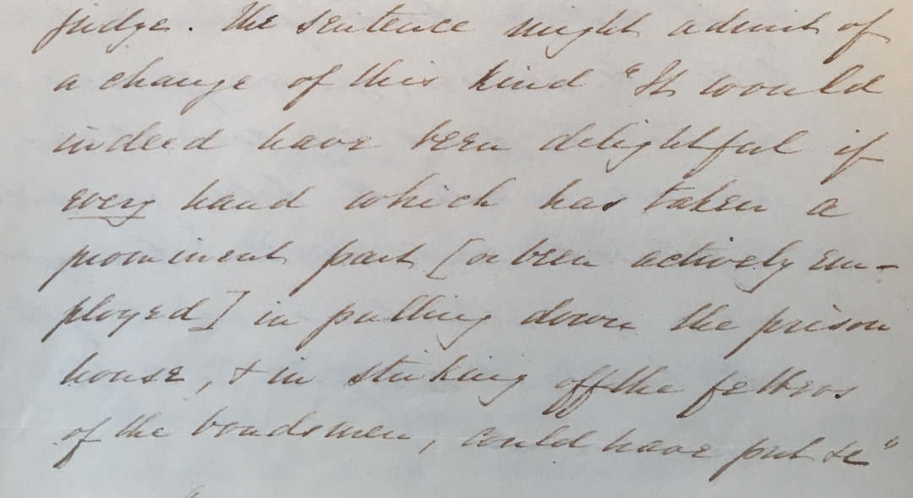
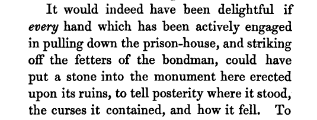

% Mary Anne Rawson's *The Bow in the Cloud* and the Networks of Anti-Slavery Literature
% Christopher Ohge  
% (*Institute of English Studies, School of Advanced Study, University of London*)

---------------

### A Definitive Object, a Solidity of Purpose

- _"The plan appears to me very promising, and I hope, and that its success will further the amiable design of its formation––as a publication ... which though so attractive to the Eye, and in some of their contributions, so touching to the heart, have always seemed to me as wanting a definitive object, a solidity of purpose..."_

_(Mary Sterndale to Mary Anne Rawson, 28 February 1833?)_

------------------

### Textual transactions

- Many of the poems submitted to Rawson were unchanged. Yet some of the submissions show a significant level of editorial engagement and judgment.

- For example, Rawson received four? submissions from Bernard Barton, two of which began and ended the volume, and two more appeared elsewhere in the volume. This suggests an attention to selection.

------------------

- Another textual transaction came with Thomas Hill's submission of "Grave of Wilberforce," a poem that went through several apologies as well as versions.

- He submitted three versions to Rawson. The first fair copy submission is rather interesting, because it includes both minor revisions, as well as a note penciled in at the end of the poem:

------------------

- Here is the note zoomed in:

>_My Dear Mrs Rawson
I am ashamed of the lateness of my
offering, & am perfectly conscious of its ..._

- Yet he submitted another fair copy, which included a revision to the stanza beginning "For lo!"

------------------

- Another clue left in the manuscripts comes from J. W. H. Pritchard's 26 December 1833 letter to Rawson, suggesting changes to Miss Williams's poem (to which himself provided the title "Voice from the Land of Bondage").

   

------------------

- Pritchard's next letter from 11 April 1834 is crucial.

- *The sentence might admit of a change of this kind "It would indeed have been delightful if* every *hand which has taken a prominent part [or been actively employed] in pulling down the prison house, &amp; in striking off the fetters of the bondsmen, could have put &c"*

------------------

Here it is as published:

------------------

### Publication History

- While in many ways *BIC* was a publication of Northern writers and activists, it was published by Jackson and Walford (St. Paul's Churchyard).

- The book was sold for 12 shillings, about 50 GBP in today's money; about two days pay for a skilled tradesman, or the cost of a week's supply of butchered meat and tea.

- The volume is indeed handsome: foolscap octavo gilt pages, tightly bound in a turkey morocco binding with a gilded engraving of the bow. The advertisement called attention to its quality.

------------------

### Reception

- The publisher, Jackson and Walford (18 St Paul's Church-yard) was also responsible for the *Eclectic Review*, The *Congregational Year Books*, and other ecclesiastical books.

- One of the contributors to *The Bow in the Cloud*, Josiah Conder, had since 1813 been the owner and editor of the *Eclectic Review*, which also featured a substantial and laudatory review of *BIC* in its July 1834 issue.

- The periodical also had a wide American readership (it was reprinted Foster, Bisbee, and Co. in New York).

------------------

### New Discoveries

- Rawson chose not to publish every piece she received.

- Perhaps the most important of the rejected pieces comes from Dinah Ball, whose poem glorifying Toussaint L'Ouverture must have been too controversial for a volume largely framed around Christian piety, not the violent revolution that is clearly celebrated in the opening stanzas.

------------------

------------------

>_Toussaint Louverture._
 _Cast a reflective glance athwart the flood
To that bold Isle where prowess and renown
Have urged their course through deluges of blood,
And snapped the Tyrant's yoke, and scorned his frown._
 _When Europe's unrelenting hand had swayed,
With scorpion rod, Domingo's land of slaves,
And Negro-vengeance had her deeds repaid
By massacres that died the circling waves,_
 _Benignant Heaven, in mercy to the oppressed,
Nurtured a Hero of the [jitty?] race,
This mighty soul with ample views possessed,
And stamped with moral dignity his face._

------------------

The poem encompasses seven manuscript pages, and it is truly a great pity that the poem was left out. For the first time, this edition is publishing this entire poem.
